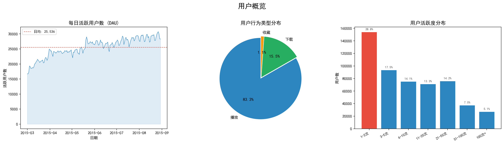
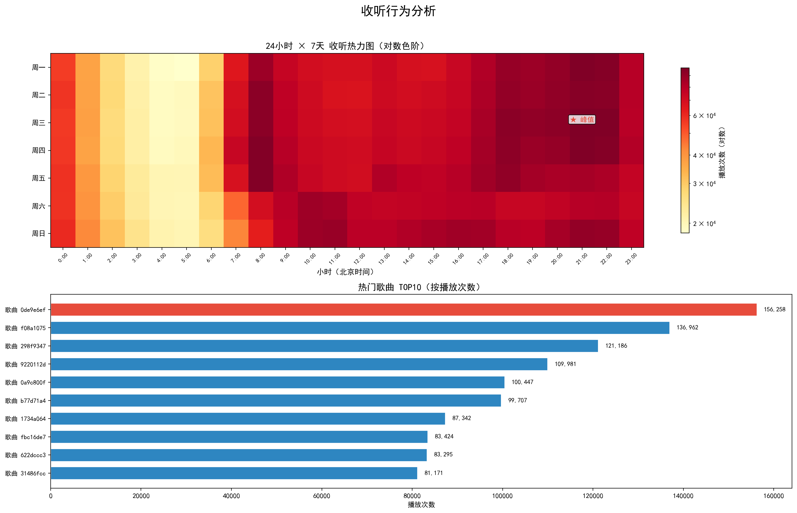
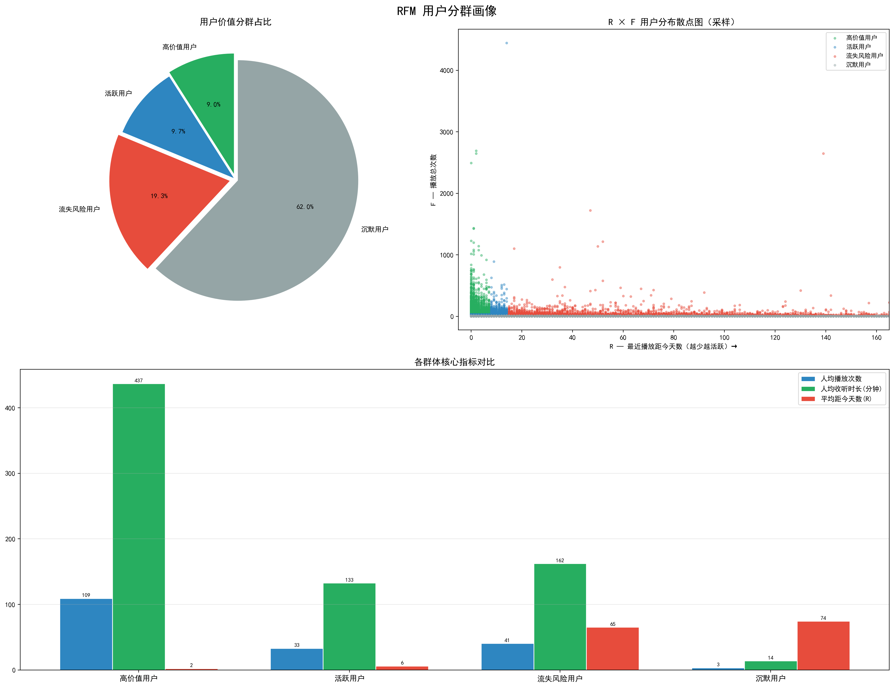

# 音乐流媒体用户行为分析与增长策略优化

> 个人项目 | 2026.07

## 项目概述

基于阿里云天池虾米音乐真实用户行为数据，完成从**数据清洗 → SQL 分析 → RFM 用户分群 → 可视化 → 增长策略**的全链路数据分析。

- **数据规模**: 1,314 万条行为记录 | 47.8 万用户 | 2.7 万首歌 | 6 个月
- **技术栈**: `Python (Pandas / NumPy / Matplotlib)` `SQL (窗口函数 / CTE)` `RFM` `AB 实验`

## 核心发现

| 指标 | 数值 | 洞察 |
|------|------|------|
| 🔴 次日留存率 | **20.1%** | 100 个新用户次日仅剩 20 个 |
| 🟢 高价值用户 | **9%** 贡献 **42.7%** 播放量 | 人均 109 次播放，帕累托分布 |
| 🟠 流失风险用户 | **19.3%** 贡献 **34%** 播放量 | 但平均已 65 天未活跃 |
| 🔵 收听峰值 | 晚间 **21:00** | 峰谷比 4.7:1，凌晨 5:00 谷值 |
| 🟡 偏好集中度 | Top1 歌曲占播放量 **53.7%** | 用户行为高度集中 |

## 用户价值分群（RFM）

| 群体 | 占比 | 播放量占比 | 人均播放 | 平均 R | 运营策略 |
|------|------|-----------|---------|--------|----------|
| 🟢 高价值用户 | 9.0% | 42.7% | 109 次 | 2.2 天 | VIP 体验、优先新歌 |
| 🔵 活跃用户 | 9.7% | 14.0% | 33 次 | 6.1 天 | 社区互动、歌单推荐 |
| 🟠 流失风险用户 | 19.3% | 34.0% | 41 次 | 65.2 天 | **定向召回（最高 ROI）** |
| ⚪ 沉默用户 | 62.0% | 9.2% | 3.4 次 | 74.5 天 | 降低触达频率 |

## 增长策略

1. **新用户「首周建歌单」引导** 预期提高次日留存率
2. **流失风险用户定向召回** — RFM 圈选 9.2 万目标用户，基于播放历史个性化 Push + VIP 体验
3. **晚间黄金时段推荐优化** — 21:00 将推荐策略从"探索模式"切换为"舒适模式"，提升人均播放时长

## 可视化看板

### 用户概览


### 收听行为


### RFM 分群画像


## 项目结构

```
├── code/
│   ├── 数据清洗与探索性分析.py     # Step 1: Pandas 数据清洗 + EDA
│   ├── SQL核心指标分析.py          # Step 2: TOP3 / 留存率 / 时段分析
│   ├── RFM用户分群.py              # Step 3: 自定义阈值 RFM 用户分层
│   └── 可视化看板.py               # Step 4: Matplotlib 3 页看板
├── image/                          # 看板截图
├── data/
│   └── README.md                   # 数据集说明
└── requirements.txt
```

## 快速复现

```bash
pip install -r requirements.txt
# 从天池下载数据集: https://tianchi.aliyun.com/dataset/51810
# 将 CSV 放入 data/ 目录，按 code/ 顺序执行脚本
```

## 数据集

阿里云天池 [虾米音乐用户行为数据](https://tianchi.aliyun.com/dataset/51810)，字段包括用户 ID、歌曲 ID、行为类型（播放/下载/收藏）、行为时间戳等，均已 MD5 脱敏。

>  原始 CSV 文件（1.4GB）未上传至 GitHub，请从天池下载。

---

*最后更新：2026.07*
